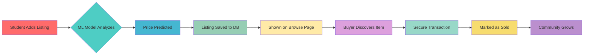

# 🎓 CollegeCart – Your Campus Marketplace Revolution! ⚡

<p align="center">

  
  
  
  


</p>

---

<p align="center">

## 🌟 **OUR VISION** 🌟

> **"Empowering every student to build a sustainable campus economy"**

**🎯 Target Launch: August 1st, 2024 at BPIT**  
**🚀 Expansion: Multi-college presence across India**

### 🌐 **Try It Now!**
**[🚀 Live Demo](https://college-community-iqr1.onrender.com/)** - Experience the future of campus commerce!

</p>

---

<p align="center">


</p>

## ✨ **What is CollegeCart?** ✨

<p align="center">

**CollegeCart** is not just another marketplace — it's a **revolutionary student community platform** designed exclusively for **Bhagwan Parshuram Institute of Technology (BPIT)** that transforms how students buy, sell, and connect within their campus ecosystem.

**[🎯 Try CollegeCart Now](https://college-community-iqr1.onrender.com/)** - Experience the revolution!

</p>

### 🎯 **Core Mission**
- 🏫 **Campus-First**: Built specifically for BPIT students
- ♻️ **Sustainability**: Reduce waste through item reuse
- 💰 **Economic Empowerment**: Help students save and earn
- 🤝 **Community Building**: Foster trust and connections
- 🧠 **AI-Powered**: ML-driven price predictions for fair deals

---

## 🚀 **Key Features That Light Up Your Experience** 🚀

<p align="center">
  
</p>

### 🏠 **Homepage - Your Command Center**
<p align="center">


</p>

- ⚡ **Live Leaderboard**: Real-time seller rankings with dynamic updates
- 🎯 **Smart Category Carousel**: AI-powered item categorization
- 📬 **Integrated Query System**: Direct communication with support
- 🌟 **Animated UI Elements**: Smooth transitions and hover effects
- 📊 **Live Statistics**: Real-time marketplace metrics

### 📤 **Sell Page - ML-Powered Intelligence**
<p align="center">


</p>

- 🧠 **AI Price Prediction**: Advanced ML models using `joblib` and `scikit-learn`
- 📸 **Smart Image Upload**: Auto-optimization and categorization
- 💡 **Smart Suggestions**: AI recommends optimal pricing
- ⚡ **Instant Processing**: Real-time price calculations
- 🎨 **Beautiful Interface**: Modern, responsive design

### 🛒 **Browse Page - Discovery Engine**
<p align="center">


</p>

- 🔍 **Advanced Filters**: Category, price range, date, condition
- 💬 **Direct Communication**: Built-in messaging system
- 📱 **Mobile-Optimized**: Perfect experience on all devices
- ⚡ **Lightning Fast**: Optimized search and loading
- 🎯 **Smart Recommendations**: AI suggests similar items

### 👤 **Profile Page - Your Digital Identity**
<p align="center">


</p>

- �� **Complete History**: All listings, purchases, and sales
- 🎨 **Customizable Banners**: Personalize your profile
- 📊 **Analytics Dashboard**: Track your marketplace performance
- ⭐ **Reputation System**: Build trust through ratings
- 🏆 **Achievement Badges**: Gamified engagement

### 🛠 **Admin Panel - Power to the Team**
- 🔐 **Advanced Moderation**: AI-powered content filtering
- 📊 **Real-time Analytics**: Live marketplace insights
- 📨 **Query Management**: Efficient support system
- 🚀 **Performance Monitoring**: System health tracking

---

## 🎯 **Why CollegeCart? The Problem We Solve**

<p align="center">
  
</p>

### 📊 **The Challenge**
Every semester, students face the same dilemma:
- 📚 **Expensive textbooks** that become obsolete
- 🧪 **Lab equipment** used for just one semester
- 👕 **Lab coats and uniforms** that gather dust
- 🧮 **Calculators and tools** that could serve others

### 💡 **Our Solution**
CollegeCart creates a **circular economy** within your campus:
- ♻️ **Reduce waste** through item reuse
- 💰 **Save money** on essential items
- ⚡ **Faster transactions** within trusted network
- 🤝 **Build community** through shared resources

---

## 🌟 **Benefits Matrix**

| For Students 🎓 | For Campus 🏫 | For Environment 🌍 |
|-----------------|---------------|-------------------|
| 💰 **Save 60-80%** on textbooks | ♻️ **Promotes sustainability** | 🌱 **Reduces carbon footprint** |
| 💸 **Earn from unused items** | 🧠 **Shows student innovation** | 📦 **Minimizes waste** |
| ⚡ **Instant campus transactions** | 🔐 **Monitored, secure platform** | 🌿 **Encourages reuse culture** |
| 🤝 **Build trusted relationships** | 📈 **Enhances campus reputation** | 💚 **Fosters eco-consciousness** |

---

## 🧰 **Technology Stack - Built for Scale**

<p align="center">
  
</p>

<p align="center">

| Layer | Technology | Purpose |
|-------|------------|---------|
| 🖥️ **Frontend** | HTML5, CSS3, JavaScript | Responsive, animated UI |
| 🔧 **Backend** | Flask (Python) | Robust API server |
| 🗄️ **Database** | MongoDB Atlas | Scalable cloud storage |
| 🤖 **AI/ML** | Scikit-learn, Joblib | Price prediction engine |
| ☁️ **Deployment** | Render | High-performance hosting |
| 🖼️ **Media** | Cloudinary | Fast image delivery |
| 🔐 **Security** | JWT, OAuth | Enterprise-grade auth |

</p>

---

## 🔄 **How It Works - The Magic Behind the Scenes**



---

## 🚀 **Launch Roadmap - Our Vision**

<p align="center">
  
</p>

### 🎯 **Phase 1: BPIT Launch (August 1st, 2024)**
- ✅ **Beta Testing**: Internal team testing
- 🚧 **User Onboarding**: Student registration drive
- 📱 **Mobile Optimization**: Perfect mobile experience
- 🎉 **Launch Event**: Campus-wide announcement

### 🌟 **Phase 2: BPIT Expansion (September 2024)**
- 📊 **Analytics Integration**: Performance tracking
- 🎮 **Gamification**: Points, badges, leaderboards
- 💬 **Messaging System**: Direct buyer-seller communication
- 📱 **Mobile App**: Native iOS/Android apps

### 🌍 **Phase 3: Multi-College Expansion (2025)**
- 🏫 **Partner Colleges**: Delhi University, IP University
- 🌐 **Regional Expansion**: Mumbai, Bangalore, Chennai
- 🏆 **National Presence**: 50+ colleges by 2026
- 🌟 **International**: Global student marketplace

---

## 💻 **Local Development Setup**

<p align="center">
  
</p>

```bash
# 🚀 Quick Start
git clone https://github.com/your-username/collegecart.git
cd collegecart

# 🐍 Python Environment
python -m venv venv
source venv/bin/activate   # Linux/Mac
# or
venv\Scripts\activate      # Windows

# 📦 Install Dependencies
pip install -r requirements.txt

# ⚙️ Environment Setup
# Create .env file with:
SECRET_KEY=your_super_secret_key_here
MONGO_URI=your_mongodb_atlas_connection_string
CLOUDINARY_URL=your_cloudinary_credentials

# 🚀 Run the Application
python app.py
```

### 🔧 **Development Features**
- 🔄 **Hot Reload**: Automatic server restart on changes
- 🐛 **Debug Mode**: Detailed error logging
- 📊 **Performance Monitoring**: Real-time metrics
- 🔒 **Security Headers**: Production-ready security

---

## 🚀 **Deployment Architecture**

<p align="center">
  
</p>

<p align="center">

### 🌐 **Production Stack**

| Component | Technology | Purpose |
|-----------|------------|---------|
| **Web Server** | Gunicorn + Flask | High-performance WSGI |
| **Database** | MongoDB Atlas | Managed cloud database |
| **CDN** | Cloudinary | Global image delivery |
| **Hosting** | Render | Auto-scaling platform |
| **Monitoring** | Custom Analytics | Real-time insights |

</p>

---

## 🧑‍💻 **Meet the Team - The Visionaries**

<p align="center">
  
</p>

<p align="center">

### 👤 **[Sangya](https://github.com/sangya-25)** - Full Stack Architect
  

**🎯 Role**: Full Stack Developer & Project Lead  
**🏫 College**: Bhagwan Parshuram Institute of Technology  
**💡 Expertise**: Flask, MongoDB, ML Integration  
**🌟 Vision**: "Building the future of campus commerce"

---

### 👤 **[Kunal Sharma](https://github.com/KunnuSherry)** - Innovation Engineer
  

**🎯 Role**: Full-Stack Developer & UI/UX Specialist  
**🏫 College**: Bhagwan Parshuram Institute of Technology  
**💡 Expertise**: Frontend Development, User Experience  
**🌟 Vision**: "Creating seamless student experiences"

</p>

---

## 🎯 **Our Commitment to Excellence**

<p align="center">
  
</p>

<p align="center">

### 🌟 **Quality Standards**
- 🔒 **Security First**: Enterprise-grade authentication
- ⚡ **Performance**: Sub-2-second load times
- 📱 **Mobile-First**: Perfect on all devices
- 🎨 **User Experience**: Intuitive, beautiful design
- 🔄 **Scalability**: Built for millions of users

### 🚀 **Innovation Pipeline**
- 🤖 **AI Integration**: Advanced ML features
- 📊 **Analytics**: Deep insights and reporting
- 🌐 **API Ecosystem**: Third-party integrations
- 🎮 **Gamification**: Engagement through fun

</p>

---

## 📈 **Success Metrics - Our Goals**

<p align="center">
  
</p>

| Metric | Target | Timeline |
|--------|--------|----------|
| 📊 **Active Users** | 1000+ BPIT students | August 2024 |
| 💰 **Transaction Volume** | ₹50,000+ monthly | September 2024 |
| 🌍 **College Expansion** | 5+ colleges | 2025 |
| 🏆 **User Satisfaction** | 95%+ rating | Ongoing |
| ♻️ **Waste Reduction** | 70% less discarded items | 2025 |

---

## 🤝 **Get Involved - Join the Revolution**

<p align="center">
  
</p>

<p align="center">

### 🎯 **For Students**
- 📱 **Join the Beta**: Early access to features
- 💡 **Share Ideas**: Help shape the platform
- 🚀 **Spread the Word**: Tell your friends

### 🏫 **For Colleges**
- 🤝 **Partnership**: Bring CollegeCart to your campus
- 📊 **Analytics**: Campus commerce insights
- 🌟 **Innovation**: Showcase student innovation

### 💼 **For Investors**
- 📈 **Growth Potential**: Multi-billion dollar market
- 🎯 **Proven Model**: BPIT success story
- 🌍 **Scalability**: Global expansion ready

</p>

---

## 📞 **Connect With Us**

<p align="center">
  
</p>

<p align="center">

### 📧 **Contact Information**
- 📧 **Email**: collegecart@bpit.ac.in
- 📱 **WhatsApp**: +91-XXXXXXXXXX
- 🌐 **Website**: [collegecart.bpit.ac.in](https://collegecart.bpit.ac.in)
- 📍 **Location**: Bhagwan Parshuram Institute of Technology, Delhi

### 🌟 **Follow Our Journey**
- 📱 **Instagram**: @collegecart_official
- 🐦 **Twitter**: @CollegeCart_BPIT
- 💼 **LinkedIn**: CollegeCart - Campus Marketplace

</p>

---

## 📝 **License & Legal**

<p align="center">
  
</p>

<p align="center">

This project is licensed under the **MIT License** - see the [LICENSE](LICENSE) file for details.

**🔒 Privacy Policy**: Your data is secure with us  
**📋 Terms of Service**: Fair and transparent usage  
**🛡️ GDPR Compliant**: European data protection standards

</p>

---

<p align="center">

## 🌟 **The Future is Here** 🌟

> **"From BPIT to the world - we're building the future of campus commerce, one transaction at a time."**

**🎯 Launch Date: August 1st, 2024**  
**🚀 Join the revolution today!**

---

### ⚡ **Built with 💙 by BPIT students, for BPIT students, and the world.**

</p>
